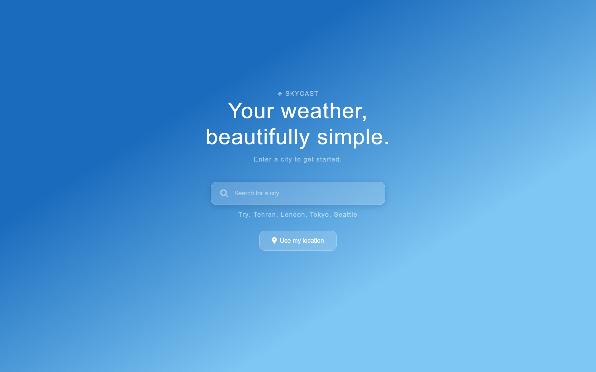
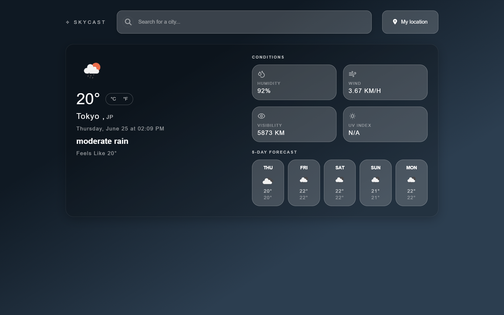
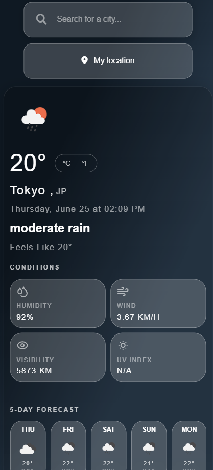

# Skycast - Weather App 🌤️

this is my first real project that uses an external API. i built it while learning frontend development and honestly had a lot of trouble with async/await at first but eventually got the hang of it.

## what it does

- search weather for any city in the world
- shows current temperature, humidity, wind speed, visibility
- 5 day forecast
- detects if its day or night and changes the background color
- use my location button (had to learn about geolocation API for this one)
- toggle between celsius and fahrenheit
- if you type a wrong city name it shows an error screen instead of just breaking

## techs used

- HTML
- CSS (flexbox and grid for layout)
- Vanilla JavaScript (no frameworks, just plain JS)
- OpenWeatherMap API

## stuff i learned building this

honestly this project taught me more than i expected. some things i had no idea about before:

- how fetch and async/await actually works
- what JSON is and how to get specific data out of it like `data.main.temp`
- CSS grid for the two column layout
- how to use `localStorage` (currently disabled and commented out)
- skeleton loading screens
- how the browser geolocation API works
- git branches (used a refactor branch to clean up the code after finishing)

## how to run it

1. clone the repo

```
git clone https://github.com/ArgoVoidDev/weather-app.git
```

2. get a free API key from openweathermap.org (takes like 2 minutes)

3. Open `js/config.js` and replace the API key with your own:

```javascript
const CONFIG = {
  API_KEY: "your_api_key_here",
};
```

4. open index.html in your browser, thats it

> note: the API key takes up to 2 hours to activate after you make an account on openweathermap

## folder structure

```
skycast/
├── index.html
├── css/
│   ├── style.css        (variables, reset, global styles)
│   ├── components.css   (all the UI components)
│   └── responsive.css   (mobile and tablet styles)
├── js/
│   ├── config.js        (API key)
│   ├── api.js           (everything related to fetching data)
│   ├── ui.js            (updating the DOM with weather data)
│   ├── storage.js       (localStorage stuff)
│   └── app.js           (main logic, event listeners)
└── README.md
```

## screens

the app has 4 different screens that switch based on what's happening:

- **empty** - when you first open the app
- **loading** - skeleton screen while waiting for API response
- **weather** - shows the actual weather data (background changes based on day/night and weather condition)
- **error** - when you type an invalid city name

## known issues / things i want to fix later

- the UV index just shows N/A right now because it needs a separate API call with coordinates
- on very small screens (below 350px) some things look a bit off
- would be cool to add a search history with localStorage

## screenshots







## Live Demo

https://argovoiddev.github.io/weather-app/

---

built this as part of my frontend learning journey. took me way longer than i thought it would but learned a lot.
